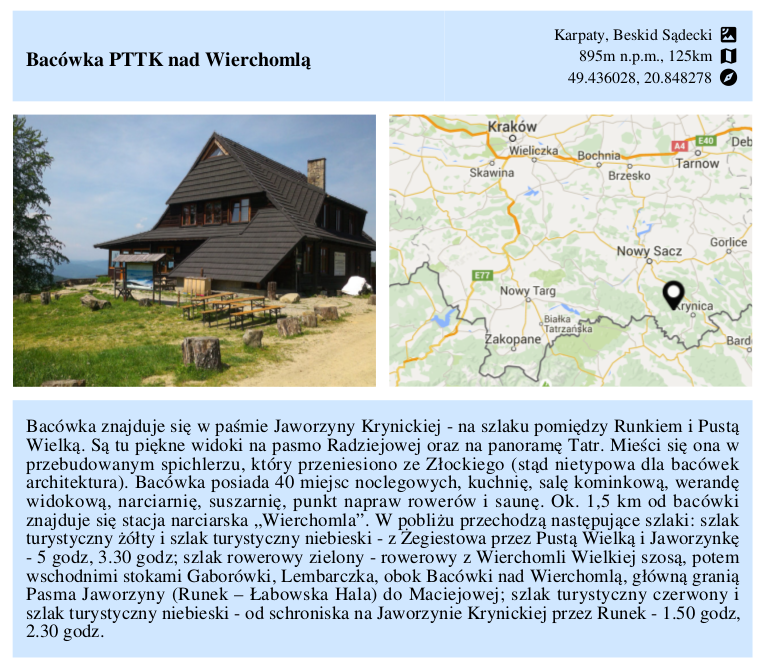
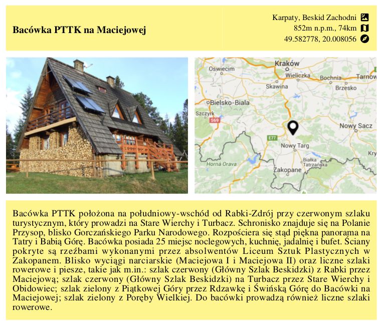

# MountainQuest-PL
Little book containing mountain shelters in Poland. Each page contains data, picture, map, description and place for stamp. Put it in your pocket, hit the road and collect all stamps! :-)

Repository contains both source code (Java) which was used to generate PDF and PDF itself.
Shalters' data was taken for muliple pages but the majority of it from http://www.gdzie-wyjechac.pl/pl/pasma-gorskie/.

Java code was writen do to it's work and is not DRY, SOLID, KISS etc... so don't expect tests ;-).
PDF is generated using iText library. 

I've created it purly for me, my family and my friends but if you find it usefull then help yourself. Input data is located in 'data' directory. Each directory there represents one page. Each page is described with two files: dane.json (data) and one png or jpg image (file's name doesn't matter). By changing data project may be easy adjusted to other languages or purposes.

Please note that all my work is licenced with CC zero lincense... but I do not own rights to data like descriptions, names and photos. Please be aware of this if you would like to use it commercially. 

Ow, almost forget... generated PDF is in polish.

Examples:

